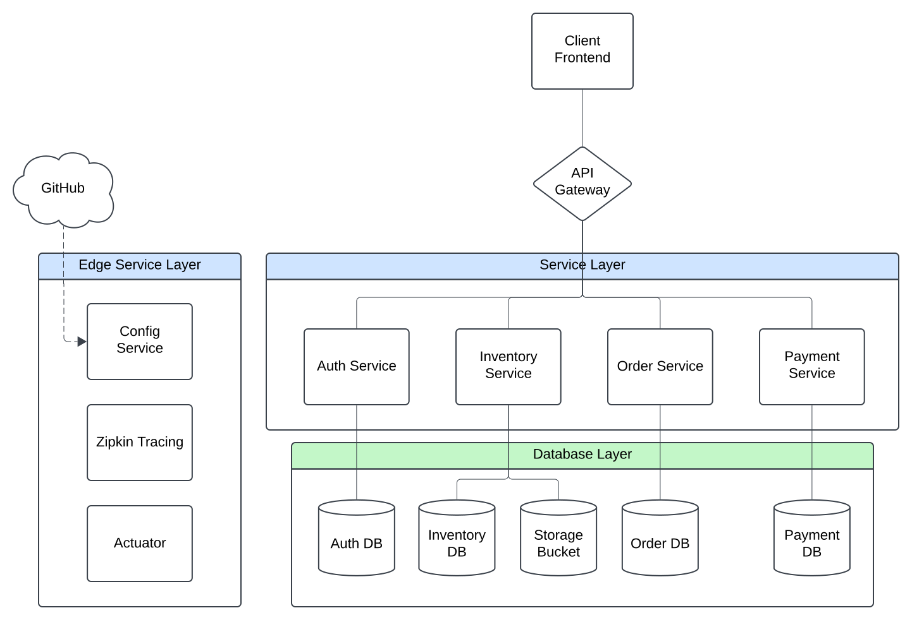

# Microservices eCommerce Application

This project is an eCommerce platform designed with a microservices architecture to provide a scalable and resilient shopping experience. Each core functionality—authentication, order processing, inventory management, payment handling, and centralized configuration—is managed by its own dedicated service.



## Project Structure

Refer to the file structure within the repository to understand the layout and organization of each microservice, configuration, database scripts, and frontend.

```
├── auth                     # Auth Service - User authentication and authorization
├── config                   # Config Service - Centralized configuration management
├── databases                # Database data and initialization scripts
├── frontend                 # Frontend application using Svelte
├── images                   # Sample images for products
├── inventory                # Inventory Service - Product management and stock control
├── order                    # Order Service - Order processing and management
├── payment                  # Payment Service - Payment processing and integrations
├── src                      # Main application entry point
├── compose.yaml             # Docker Compose file for local deployment
└── settings.gradle          # Gradle settings
```

## Features

- **Auth Service**: Handles user authentication, registration, and role-based access.
- **Config Service**: Centralized configuration using [Spring Cloud Config](https://spring.io/projects/spring-cloud-config) for streamlined microservices management.
- **Inventory Service**: Manages product data and inventory stock, with MinIO for image storage.
- **Order Service**: Processes and manages customer orders.
- **Payment Service**: Integrates with Stripe's payment processor (test mode) for transactions.
- **Frontend**: A responsive Svelte-based frontend for a seamless user experience.

## Tech Stack

- **Backend**: Java, Spring Boot, Gradle
- **Frontend**: Svelte
- **Database**: PostgreSQL
- **Object Storage**: MinIO
- **Containerization & Orchestration**: Docker Compose
- **Load Balancing & Service Discovery**: Traefik
- **Configuration Management**: Spring Cloud Config
- **Distributed Tracing**: Zipkin
- **Monitoring & Health Checks**: Spring Boot Actuator
- **Payment Processor**: Stripe API

## Microservices Overview

| Service    | Description                                                                                       | Path       |
|------------|---------------------------------------------------------------------------------------------------|------------|
| Auth       | User authentication and role-based access with JWT tokens                                         | `/auth`    |
| Config     | Centralized configuration management                                                              | N/A |
| Inventory  | Manages product data and stock, integrated with MinIO for product image storage                   | `/inventory` |
| Order      | Order processing with Inventory and Payment service integrations                                 | `/order`   |
| Payment    | Payment processing, interacting with external payment gateways                                    | `/payment` |
| Frontend   | Svelte-based frontend that communicates with backend microservices                                | N/A |

## Getting Started

### Prerequisites

Ensure you have the following installed to run:
- **Docker** and **Docker Compose** for containerization

And for development :
- **Java 17+**
- **Gradle** for dependency management
- **Node.js** and **npm** (for frontend setup)

### Running Locally

1. **Clone the repository**:
- Remove `--recurse-submodules` if you don't want to clone the service configuration files (this does not affect runtime).
```bash
git clone --recurse-submodules https://github.com/robinlafontaine/microservices-ecommerce.git
```
2. **Start Docker Containers**:
- Use Docker Compose to start the entire microservices environment:
```bash
docker-compose -f compose.yaml up --build
```
3. **Access Website**:
- Frontend: `http://localhost:3000`
 
4. **Default User Credentials**
- Admin:
   - admin@example.com
   - password
- User:
   - user@example.com
   - password
- Create a custom user (`USER` role) at `/register`

5. **Payment Method**
- Stripe's test API allows for *fake* credit cards such as :
```
Card n°: 4242424242424242
CVC: Any 3 digits (ex: 123)
Date: Any future date (ex: 12/35)
```
See more in Stripe's API [docs](https://docs.stripe.com/testing)

## Project Configuration
- Environment Variables: The [ecommerce-config](https://github.com/robinlafontaine/ecommerce-config) repository stores the configurations for each service. Other variables are stored in the Docker Compose file.
- Centralized Configurations: The *config-service* (Spring Cloud Config) manages environment-specific configurations.
- Database schemas are initialized via SQL scripts located in `databases/scripts`. These are automatically applied when the services start.\

> [!NOTE]
> If you wish to reset the project to it's innitial state you must remove the following directories :
> - `/databases/auth`
> - `/databases/inventory`
> - `/databases/order`
> - `/databases/payment`
> - `/minio`
> - Clear browser cookies for `localhost:3000`

## Improvements

This project is ***NOT*** production ready, it is simply a university project and a learning experience.\
There are several areas in this project that can be enhanced to further improve performance, scalability, and maintainability:

1. **Logging and Monitoring**:
   - Enhance logging with **structured logging** to ensure logs are consistent and easy to read.
   - Enable more **basic metrics** from **Spring Boot Actuator** to track CPU, memory, and disk usage across services.

2. **Testing and QA**:
   - Enhance **unit and integration test coverage** across all services.
   - Set up **test containers** to spin up isolated environments for testing databases and other dependencies.

3. **CI/CD Pipeline**:
   - Establish a **CI/CD pipeline** using GitHub Actions to automate builds, testing, and deployment processes.
   - Add automated **security scans** for vulnerabilities in dependencies and Docker images.
      -  GitHub's repo secret scanning is sufficient for now.

4. **Documentation**:
   - Create API documentation using **Swagger/OpenAPI** for all microservices to facilitate development and integration.
   - Add an architectural diagram and more extensive comments to improve code readability.

5. **Enhanced Security**:
    - Implement **rate limiting** and **throttling** at the gateway level to prevent abuse and ensure fair resource use.
    - Use a secrets management tool to securely manage API keys and database credentials.
    - Secure session cookies and session states.

